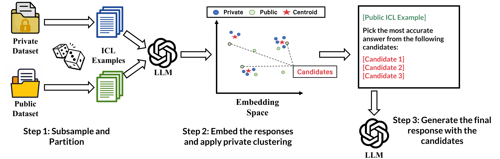

# Public Data Assisted Differentially Private In-Context Learning — EMNLP 2025 Findings

[](https://www.arxiv.org/abs/2509.10932)
<!--
[](https://arxiv.org/abs/2410.13321)
-->




**Workflow**  
1) Sample ICL examples from **private** and **public** sets.  
2) Generate **ensemble** LLM responses.  
3) **Privately aggregate** (e.g., DPM / KSA joint EM) and shortlist candidates.  
4) Pick the **final** response, optionally guided by public examples.

---

## Quick Start

### 1) Install
```bash
pip install -r requirements.txt
# set your key securely (DON'T hardcode in code)
export OPENAI_API_KEY="sk-..."
```

### 2) Run in-context learning with each ICL example (generation → embeddings/cluster)

```bash
# QA example
./run_e2e.sh qa_e2e

# Summarization example
./run_e2e.sh sum_e2e

# QA OOD variant (public in-dist, test from OOD subset)
./run_e2e.sh qa_e2e_ood
```

### 3) Finalize (pick one answer + score)
```bash
# QA, DPM representatives (BLEU/METEOR/ROUGE-1)
./finalize_examples.sh qa_dpm

# QA, KSA (joint EM) with selection prompt
./finalize_examples.sh qa_ksa

# Summarization, DPM (ROUGE-1/2/L)
./finalize_examples.sh sum_dpm

# Summarization, KSA (generate prompt)
./finalize_examples.sh sum_ksa_gen
```

### Outputs
```bash
output/
  <stem>_public.json
  <stem>_private.json
semantic_group/
  <stem>_<split>/
    0.npy 1.npy ...
    <stem>_<split>_clusters_thr0.90.json
final_outputs/
  <stem>_<split>_<method>_<task>.json
```

---
## `script/embedding_generation.sh`
- **Purpose:** End-to-end generation → embeddings (+optional clustering)

**Key Vars (override via env before the command)**
- `OPENAI_API_KEY` — OpenAI key (required for generation)
- `EMBED_MODEL` (default: `text-embedding-3-small`) — Embedding model
- `SIM_THR` (default: `0.90`) — Clustering similarity threshold
- `DS_SIZE` (default: `100`) — # test examples
- `ENSEMBLE` (default: `100`) — # prompts per example
- `ICE_NUM` (default: `4`) — # in-context examples
- `MAX_TOKEN` (default: `200`) — Generation max tokens
- `TEMP` (default: `0.02`) — Generation temperature
- `QA_DATA` / `QA_MODEL` — QA dataset/model
- `SUM_DATA` / `SUM_MODEL` — Summarization dataset/model

**Commands**
- `qa_e2e` — QA: generate → embed → cluster
- `sum_e2e` — Summarization: generate → embed → cluster
- `qa_e2e_ood` — QA with OOD test (`--ood --ood_subset` inside)

**Examples**
- `DS_SIZE=20 ENSEMBLE=10 ./embedding_generation.sh qa_e2e`
- `EMBED_MODEL=text-embedding-3-large SIM_THR=0.95 ./embedding_generation.sh sum_e2e`

## `script/finalize_example.sh`
- **Purpose:** Finalize one answer/summary per question (+metrics)

**Key Vars**
- `OPENAI_API_KEY` — OpenAI key (required for LLM-based finalize)
- `TOPK` (default: `3`) — # candidates (DPM/cluster/LLM)
- `MAX_TOKEN` (default: `200`), `TEMP` (default: `0.02`) — Finalization LLM
- `SIM_THR` (default: `0.90`) — For cluster-rep
- `ENSEMBLE`, `ICE_NUM` — Must match E2E (builds `<stem>`)
- `QA_MODEL`, `SUM_MODEL` — Used to form `output/<stem>...`

**Commands**
- `qa_dpm` — QA, DPM (public+private)
- `qa_ksa` — QA, KSA (joint) selection
- `sum_dpm` — Summarization, DPM (public+private)
- `sum_ksa_gen` — Summarization, KSA generate
- `qa_dpm_ood` — QA, DPM on OOD split

**Examples**
- `./finalize_example.sh qa_dpm`
- `./finalize_example.sh qa_ksa`
- `./finalize_example.sh sum_cluster_rep`


---
## Repo Map (tl;dr)

- `e2e_pipeline.py` — **Load → Prompt → Generate → Embed → (opt.) Cluster**  
- `finalize_outputs.py` — **DPM / KSA / Cluster-rep / LLM-select / Majority** to produce final answers + metrics  
- `run_e2e.sh` — E2E runner (generation → embeddings/cluster)  
- `finalize_examples.sh` — Finalization runner only  
- `gen_util.py` — Your retriever & model caller (`UWORetriever`, `complete`)  
- `output/` — Raw generations: `<stem>_{public|private}.json`  
- `semantic_group/` — Per-Q embeddings (`.npy`) & cluster JSON  
- `final_outputs/` — Final predictions: `<stem>_<split>_<method>_<task>.json`

> **Note.** `<stem> = <dataset>_<model>_<ensemble>way-<ice_num>shot`

---

## Methods (finalization)

Choose how to collapse an ensemble of candidate responses into **one final answer** per question.

### 1) DPM (Differentially Private Clustering, **Main Method**)
- **What it does:** Runs `DPM.perform_clustering()` on per-question embeddings, ranks clusters by size, then picks **representatives** nearest to cluster centers.
- **Privacy knobs:** `--dpm_eps` (ε), `--dpm_eps_em` (exp scale), `--dpm_eps_gm` (avg scale), `--dpm_levels` (split depth).
- **Candidate pool:** `--dpm_pool {public|private|all|auto}`. For `public+private`, `auto` restricts to public by default.
- **When to use:** You want DP-aware grouping with robust, diverse candidates from high-mass clusters.

### 2) KSA (Joint Exponential Mechanism)
- **What it does:** Builds **token histograms** over ensemble outputs, then uses `joint()` (exponential mechanism) to select **top-k tokens**.
- **Prompting modes:**
  - `ksa-select`: 1-shot **selection** prompt with candidate list → model picks best answer.
  - `ksa-generate`: 1-shot **generation** prompt with token hints → model writes an answer.
- **Privacy knob:** `--ksa_eps` (ε); `inf` ≈ top-k by counts (no DP).
- **Token source:** `--ksa_source {public|private|public+private|split}`.
- **When to use:** You want DP token-level aggregation with a light LLM decision/generation step.

**Task-Aware Behavior**
- **QA:** KSA prompts use `Question:/Answer:`; metrics default to **BLEU-1 / METEOR / ROUGE-1**.
- **Summarization:** KSA prompts use `Dialogue:/The summary is:`; metrics default to **ROUGE-1/2/L**.

---

## Consider citing our paper
```bibtex
@misc{joo2025publicdataassisteddifferentially,
      title={Public Data Assisted Differentially Private In-Context Learning}, 
      author={Seongho Joo and Hyukhun Koh and Kyomin Jung},
      year={2025},
      eprint={2509.10932},
      archivePrefix={arXiv},
      primaryClass={cs.AI},
      url={https://arxiv.org/abs/2509.10932}, 
}
```

---
## Acknowledgements

This repository adapts and extends [Wu’s prior work on private ICL](https://github.com/tongwu2020/DP-ICL).