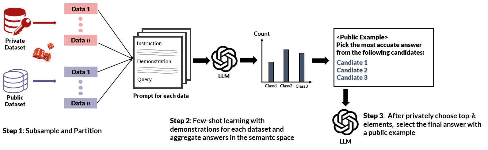

# PubDP-ICL 
## This is repository of paper "Public Data Assisted Differentially Private In-context Learning"  
--- 
## 🤔 What is the paper for?

This work aims to achieve private in-context learing robust to inference attack while maintaining utlity with the help of public data 

## Framework
</img>


## How to use 
1. Install requirments

```bash
pip install -r requirements.txt 
```

2. Run ICL with each ICL example 

```bash
run.sh 
```

3. Construct semantic group 

```bash
semantic_group.sh 
``` 

4. Generate final response 
Refer to `<benchmark>.ipynb` 

### Acknowledgements 
This repository is adapted from Tang's work. 